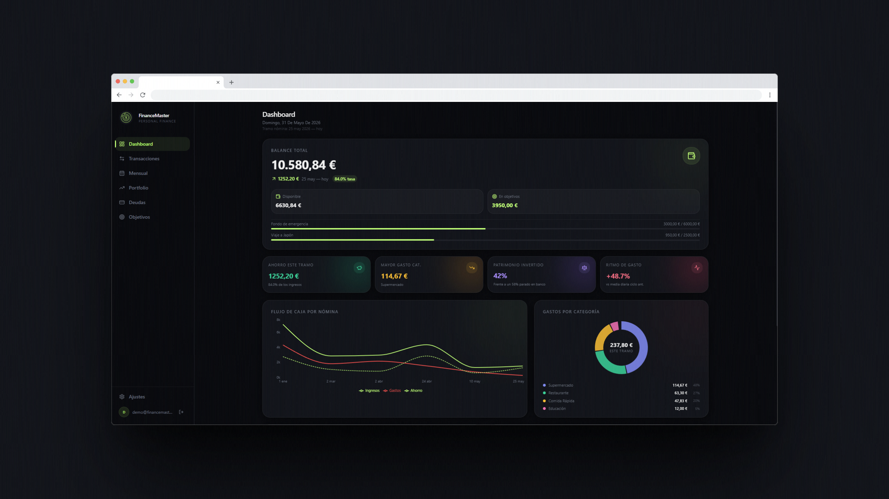
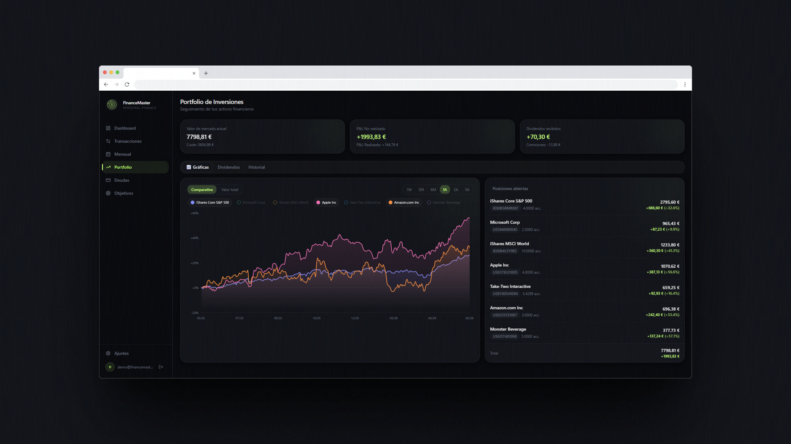
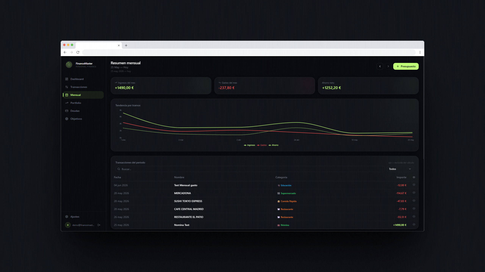
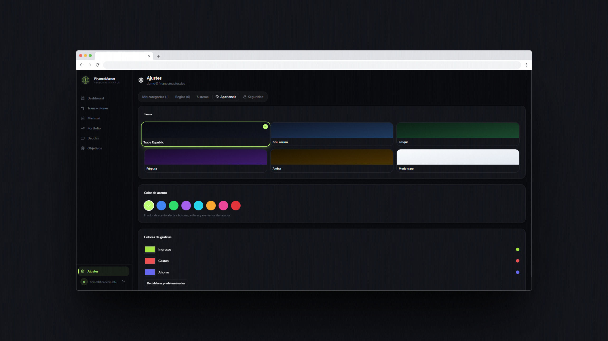
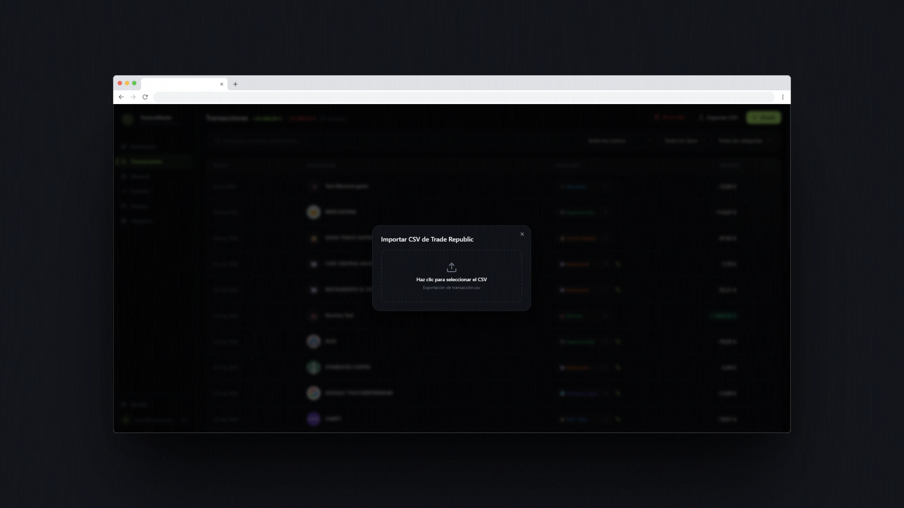

<div align="center">


# FinanceMaster

**Tu gestor de finanzas personales, autoalojado y sin suscripciones.**

Importa tus movimientos de Trade Republic, analiza tus gastos, controla tu portfolio de inversiones y mantén el control total de tu dinero — todo en una sola app.

[](https://ghcr.io/ronambulo/financemaster)
[](LICENSE)
[](https://ghcr.io/ronambulo/financemaster)

</div>

---

## 📸 Vista previa



---

## ✨ Características

| Módulo               | Descripción                                                                                                                       |
| -------------------- | --------------------------------------------------------------------------------------------------------------------------------- |
| 📊 **Dashboard**     | Resumen mensual de ingresos, gastos y ahorro. Tendencia de los últimos meses y próximos pagos recurrentes.                        |
| 📅 **Mensual**       | Análisis por tramos de nómina. Desglose de categorías, tabla de transacciones y gráfica de tendencia personalizable.              |
| 💳 **Transacciones** | Listado completo con filtros, búsqueda, edición de categorías y marcado de transacciones a excluir de estadísticas.               |
| 📈 **Portfolio**     | Seguimiento de inversiones con datos de mercado. Gráfica comparativa y acumulada, historial de dividendos y operaciones cerradas. |
| 🔁 **Recurrentes**   | Detección automática de pagos periódicos (suscripciones, recibos) y previsión del próximo cargo.                                  |
| 🎯 **Objetivos**     | Metas de ahorro con seguimiento de progreso.                                                                                      |
| 💸 **Deudas**        | Gestión de préstamos, cuotas y amortizaciones.                                                                                    |
| 📋 **Presupuestos**  | Límites de gasto por categoría.                                                                                                   |
| ⚙️ **Ajustes**       | Temas visuales, colores de acento y personalización de categorías.                                                                |

---

## 📸 Capturas de pantalla

| Dashboard                      | Portfolio                      |
| ------------------------------ | ------------------------------ |
|  |  |

| Mensual                      | Ajustes                       |
| ---------------------------- | ----------------------------- |
|  |  |

---

## 🚀 Instalación

### Docker (recomendado)

```yaml
services:
  financemaster:
    image: ghcr.io/ronambulo/financemaster:latest
    container_name: financemaster
    restart: unless-stopped
    ports:
      - "8000:8000"
    volumes:
      - /ruta/a/tus/datos:/data
    environment:
      - SECRET_KEY=cambia-esto-por-una-clave-secreta-larga-y-aleatoria
      - DATABASE_URL=sqlite:////data/finance.db
```

```bash
docker compose up -d
```

Abre **http://localhost:8000** en tu navegador, crea tu cuenta y empieza a importar tus datos.

---

### Desarrollo local

**Requisitos**

* Python 3.11+
* Node.js 18+

```bash
git clone https://github.com/Ronambulo/FinanceMaster.git
cd FinanceMaster
```

#### Backend

```bash
cd backend
pip install -r requirements.txt
uvicorn main:app --reload --port 8000
```

#### Frontend

```bash
cd frontend
npm install
npm run dev
```

La API estará disponible en:

```text
http://localhost:8000
```

Y el frontend en:

```text
http://localhost:5173
```

---

## 📥 Importar datos de Trade Republic

1. En la app de Trade Republic ve a **Perfil → Documentos → Exportar historial**.
2. Descarga el CSV de movimientos.
3. En FinanceMaster abre **Transacciones → Importar CSV**.
4. Arrastra el archivo al área de carga.
5. La aplicación detectará y categorizará automáticamente los movimientos.

### Importación



---

## 📈 Portfolio de inversiones

* Seguimiento de acciones, ETFs y fondos.
* Evolución histórica de la cartera.
* Beneficio/pérdida total y por posición.
* Dividendos recibidos.
* Operaciones abiertas y cerradas.
* Comparativa frente a índices de referencia.


---

## 🎨 Personalización

### Temas incluidos

* Trade Republic (predeterminado)
* Azul oscuro
* Bosque
* Púrpura
* Ámbar
* Claro

### Opciones adicionales

* 8 colores de acento.
* Colores configurables para gráficas.
* Categorías personalizadas.
* Modo responsive para móvil y escritorio.

---

## 🛠️ Stack tecnológico

### Backend

* FastAPI
* SQLAlchemy
* SQLite
* yfinance
* JWT Authentication

### Frontend

* React 18
* Vite
* Tailwind CSS
* Radix UI
* Recharts
* TanStack Query

### Despliegue

* Docker
* Multi-arquitectura (amd64 / arm64)
* Compatible con CasaOS
* Compatible con ZimaOS

---

## 🔒 Privacidad

Tus datos son tuyos.

* Sin suscripciones.
* Sin servicios externos obligatorios.
* Sin compartir información financiera con terceros.
* Base de datos local.
* Despliegue completamente autoalojado.

---

## 🤝 Contribuir

Las contribuciones son bienvenidas.

1. Abre un Issue para reportar errores o sugerir mejoras.
2. Haz un Fork del proyecto.
3. Crea una rama para tu funcionalidad.
4. Envía un Pull Request.

---

## 📄 Licencia

Este proyecto se distribuye bajo la licencia MIT.
